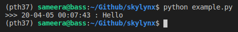
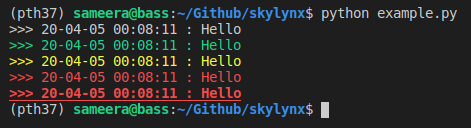
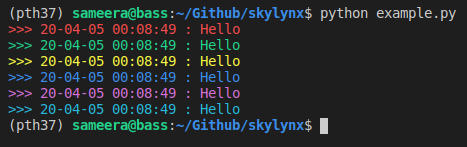

# skylynx

**Status**

[](https://travis-ci.org/basameera/skylynx)

Python support functions module

**Only Python 3**

---

## Version 0.0.4

### `skylynx` 

``` python
import skylynx
print('skylynx', skylynx.__version__)

>> skylynx 0.0.2
```

### `skylynx.utils` 

#### JSON

##### Write

``` python
import skylynx.utils as su

data_dict = dict(
    a=123,
    b='skylynx'
)
su.json_write('example.json', data_dict)
```

``` json
{
  "a": 123,
  "b": "skylynx"
}
```

##### Read

``` python
data = su.json_read('example.json')
print(data)

>> {'a': 123, 'b': 'skylynx'}
```

#### YAML

##### Write

``` python
su.yaml_write('example.yaml', data_dict)
```

``` yaml
a: 123
b: skylynx
```

##### Read

``` python
data = su.yaml_read('example.yaml')
print(data)

>> {'a': 123, 'b': 'skylynx'}
```

#### Pretty Print

``` python
data_dict = dict(
    a='This print a python dict object in a human readable form.',
    b=456,
    c=dict(
        d=123,
        e='skylynx'
    ),
    f = ['abc', 123]
)
su.pprint(data_dict, '> Header <')
```

``` bash
======================== > Header < ========================
a: This print a python dict object in a human readable form.
b: 456
c:
  d: 123
  e: skylynx
f: ['abc', 123]
------------------------------------------------------------
```

#### Make Directories

``` python
path = 'path/to/the/folder/'
su.makedirs(path)
print(os.path.exists(path))

>> True
```

#### Simple command line arguments

Add the following code to `example.py` 

``` python
from skylynx.utils import cli_args

if __name__ == "__main__":

  cli_params = dict(task=0,
                    length=10
                    )

  args = cli_args(cli_params)
  task = args['task']
  length = args['length']
```

**How to use**

``` bash
python example.py -h
```

``` 
usage: test.py [-h] [-a A] [-b B]

*** Simple cli args - by Skylynx ***

optional arguments:
  -h, --help  show this help message and exit
  -a A        task (default: 0)
  -b B        length (default: 10)
```

``` bash
python example.py -a <task value> -b <length value>
```

#### clog

**Normal use**

``` python
from skylynx.utils import clog

clog('Hello')
```



**Debug Levels**

``` python
clog('Hello', verbose='DEBUG')
clog('Hello', verbose='INFO')
clog('Hello', verbose='WARNING')
clog('Hello', verbose='ERROR')
clog('Hello', verbose='CRITICAL')
```



**Colors**

``` python
clog('Hello', verbose='RED')
clog('Hello', verbose='GREEN')
clog('Hello', verbose='YELLOW')
clog('Hello', verbose='BLUE')
clog('Hello', verbose='MAGENTA')
clog('Hello', verbose='CYAN')
```



